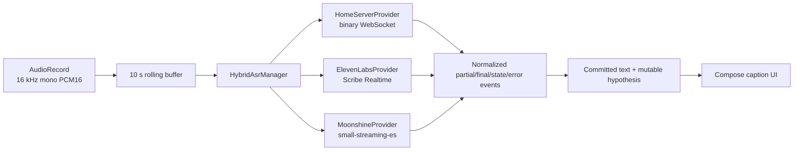

# LiveCaption

Realtime Spanish accessibility captions with automatic provider failover:

1. Home server: NVIDIA Parakeet-TDT 0.6B v3.
2. ElevenLabs Scribe Realtime.
3. On-device Moonshine Spanish.

## Motivation

LiveCaption was created to help family members with hearing difficulties actively participate in conversations and social gatherings. By providing real-time captions of audio from the surrounding environment, the app enables better communication and inclusion.

## Features

- **Hybrid ASR**: prefers the private home server and falls back without restarting microphone capture
- **Rolling replay**: keeps 10 seconds of PCM and replays the uncommitted region after provider failure
- **Stable committed text**: only the current hypothesis is rewritten during failover
- **Offline fallback**: Moonshine runs only when selected or required
- **Simple Interface**: Large, easy-to-read text display (40sp font size) with auto-scrolling to the latest caption
- **No History or Data Retention**: All transcriptions are temporary—close the app or restart to clear them
- **No Ads or Tracking**: Completely ad-free with zero analytics or user tracking
- **Always-On Display**: Screen stays on while the app is running for continuous viewing
- **Privacy-Focused**: audio is sent only to the active provider and is never recorded to disk
- **Minimal Dependencies**: Built with modern Android libraries (Jetpack Compose, OkHttp, Kotlin Coroutines)

## Installation

### Prerequisites

- Android 8.0 (API 26) or higher
- An ElevenLabs API key
- Microphone and internet permissions granted

### Setup

1. **Clone the repository**:
   ```bash
   git clone https://github.com/danngalann/livecaption.git
   cd livecaption
   ```

2. **Configure ElevenLabs API Key**:
   - Create a `local.properties` file in the project root (if it doesn't exist)
   - Add your ElevenLabs API key:
     ```
     ELEVENLABS_API_KEY=your_api_key_here
     HOME_SERVER_URL=https://captions.example.internal
     HOME_SERVER_TOKEN=optional_private_service_token
     ```

3. **Build and run**:
   ```bash
   ./gradlew assembleDebug
   ```
   Or open the project in Android Studio and click **Run**.

`HOME_SERVER_URL` may be `http(s)` or `ws(s)` and should not include
`/v1/transcribe`. Prefer a private LAN/VPN or a TLS reverse proxy. A token placed
in `local.properties` is compiled into the APK, so use it only as an additional
private-network control, not as a public-Internet credential.

## Architecture



The app is a single Compose application module. `AudioRecorder` is the sole
microphone owner and captures mono 16 kHz signed PCM16 from
`VOICE_RECOGNITION`, with Android noise suppression when available.
`HybridAsrManager` sends live audio only to the active provider.

The manager preserves:

- stable committed text;
- a replaceable current hypothesis;
- the latest committed audio position when a provider supplies one;
- enough pre-roll to avoid truncating initial phonemes during replay.

When timestamps are unavailable, `TranscriptReconciler` removes only a
conservative word overlap between the stable committed suffix and replacement
provider output. It never rewrites committed UI entries.

## Failover policy

Thresholds are centralized in `AsrConfig`:

| Setting | Initial value |
|---|---:|
| Rolling PCM buffer | 10 s |
| Replay pre-roll | 400 ms |
| Response timeout while an utterance is active | 4 s |
| Maximum acceptable backlog | 2.5 s |
| Slow results before failover | 3 |
| Home-server probe interval | 5 s |
| Healthy period before recovery | 15 s |

Hard provider errors fail immediately. Backlog must remain excessive across
multiple results. Recovery to the home server requires sustained health, which
prevents provider flapping. Moonshine is prepared in the background but does
not receive audio or run inference while a network provider is healthy.

## Development controls

Debug builds compile `src/debug/.../BuildVariantAsr.kt`, which adds:

- AUTO/HOME_SERVER/ELEVENLABS/MOONSHINE override;
- actual active provider and connection state;
- server RTT, transcription latency, backlog, failover count, and last error;
- editable home-server endpoint;
- repeatable "fail active provider after N seconds of audio" injection.

Release builds compile a no-op implementation from `src/release`; the debug UI
and failure-injection implementation are not packaged in release APKs.

## Home server

The FastAPI gateway, Docker deployment, protocol, metrics, and benchmark tool
live in the independent
[`danngalann/livecaption-server`](https://github.com/danngalann/livecaption-server)
repository. The runtime is NVIDIA's official NeMo-Speech.cpp with the official
Q8 GGUF model. That artifact is offline-only inside NeMo-Speech.cpp, so the
server uses explicitly documented 500 ms incremental rolling-window inference
rather than claiming native stateful model streaming.

## Build and test

1. **Launch the app**: Open LiveCaption on your Android device
2. **Grant permissions**: Allow microphone and internet permissions when prompted
3. **Start listening**: Tap the "Escuchar" (Listen) button to begin real-time transcription
4. **View captions**: Watch transcriptions appear in real-time on the screen
   - Partial (in-progress) text appears as you speak
   - Final (committed) text is added to the history when a sentence is complete
5. **Stop listening**: Tap the "Detener" (Stop) button to end transcription

## Building and Deployment

### Debug Build

```bash
./gradlew assembleDebug
```

The APK will be available at `app/build/outputs/apk/debug/app-debug.apk`.

### Release Build

```bash
./gradlew assembleRelease
```

Run unit tests and both APK builds:

```bash
./gradlew testDebugUnitTest assembleDebug assembleRelease
```

### Requirements

- Android Gradle Plugin 8.13.2
- Kotlin 2.0.21
- Gradle 8.0 or higher
- Java 11+

## Permissions

The app requires the following permissions (declared in `AndroidManifest.xml`):

- `RECORD_AUDIO` - Access to the device microphone
- `INTERNET` - Connection to ElevenLabs API

## License

This project is licensed under the MIT License—see the [LICENSE](LICENSE) file for details.

## Disclaimer

This app is provided as-is for accessibility purposes. Please note that:

- Home-server operation depends on the server keeping up in real time
- Network latency may affect transcription speed
- Background noise and audio quality will impact transcription accuracy
- Moonshine downloads its Spanish model on first preparation and requires API 26
- The current app keeps the session across Compose recomposition and the
  activity's declared configuration changes, but Android process death still
  ends microphone capture
